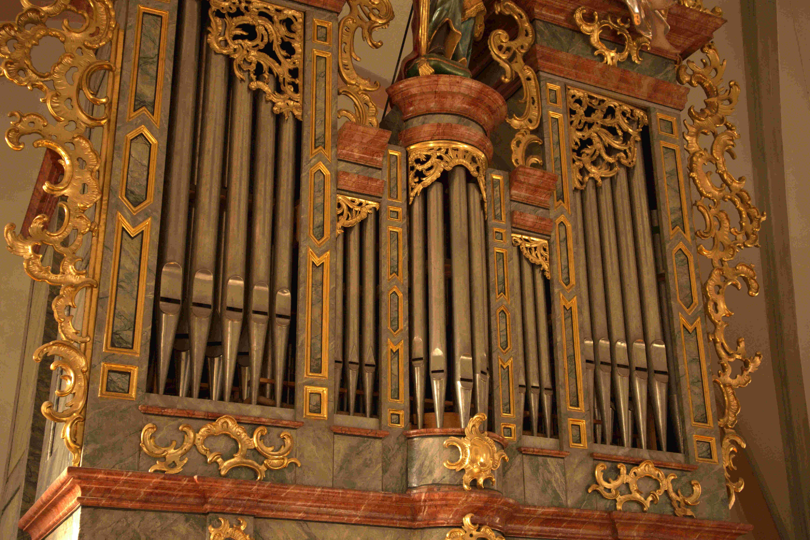

# Liedprogramme zu St. Stephan

Das ist eine Sammlung von Liedprogrammen von Pfarrer Stefan Amann, der zuletzt die
priesterlichen Dienste in der Pfarre Thüringen St. Stephan (Vorarlberg) innehatte.

## Sonntage im Advent
- [1.] Adventsonntag: 
  - [A (2016-11-27)](www/A01A_2016-11-27.pdf)
  - [B (2017-12-04)](www/A01B_2017-12-04.pdf)

- [2.] Adventsonntag: 
  - [A (2016-12-04)](www/A02A_2016-12-04.pdf)
  - [B (2017-12-10)](www/A02B_2017-12-10.pdf)

- [3.] Adventsonntag: 
  - [A (2016-12-11)](www/A03A_2016-12-11.pdf)
  - [B (2017-12-17)](www/A03B_2017-12-17.pdf)

- [4.] Adventsonntag: 
  - [A (2016-12-18)](www/A04A_2016-12-18.pdf)
  - [B (2017-12-24)](www/A04B_2017-12-24.pdf)

## Sonntage in der Weihnachtszeit
- [2.] Sonntag nach Weihnachten: 
  - [A (2020-01-05)](www/W02A_2020-01-05.pdf)

## Sonntage in der Fastenzeit
- [1.] Fastensonntag: 
  - [B (2018-02-18)](www/F01B_2018-02-18.pdf)
  - [C (2019-03-10)](www/F01C_2019-03-10.pdf)

- [2.] Fastensonntag: 
  - [A (2017-03-12)](www/F02A_2017-03-12.pdf)
  - [B (2018-02-25)](www/F02B_2018-02-25.pdf)
  - [C (2016-02-21)](www/F02C_2016-02-21.pdf)

- [3.] Fastensonntag: 
  - [B (2018-03-04)](www/F03B_2018-03-04.pdf)
  - [C (2019-03-24)](www/F03C_2019-03-24.pdf)

- [4.] Fastensonntag: 
  - [B (2018-03-11)](www/F04B_2018-03-11.pdf)
  - [C (2019-04-01)](www/F04C_2019-04-01.pdf)

- [5.] Fastensonntag: 
  - [B (2018-03-18)](www/F05B_2018-03-18.pdf)

## Sonntage in der Osterzeit
- [2.] Sonntag in der Osterzeit: 
  - [B (2018-04-08)](www/O02B_2018-04-08.pdf)
  - [C (2019-04-28)](www/O02C_2019-04-28.pdf)

- [3.] Sonntag in der Osterzeit: 
  - [B (2018-04-15)](www/O03B_2018-04-15.pdf)

- [4.] Sonntag in der Osterzeit: 
  - [B (2018-04-21)](www/O04B_2018-04-21.pdf)
  - [C (2019-05-12)](www/O04C_2019-05-12.pdf)

- [5.] Sonntag in der Osterzeit: 
  - [B (2018-04-29)](www/O05B_2018-04-29.pdf)

- [7.] Sonntag in der Osterzeit: 
  - [C (2019-06-02)](www/O07C_2019-06-02.pdf)

## Feste und Hochfeste
- Neujahr: 
  - [A (2017-01-01)](www/S01A_Neujahr_2017-01-01.pdf)
  - [A (2020-01-01)](www/S01A_Neujahr_2020-01-01.pdf)
  - [C (2019-01-01)](www/S01C_Neujahr_2019-01-01.pdf)

- Erscheinung des Herrn: 
  - [A (2017-01-06)](www/S02A_Erscheinung-des-Herrn_2017-01-06.pdf)
  - [A (2020-01-06)](www/S02A_Erscheinung-des-Herrn_2020-01-06.pdf)
  - [B (2018-01-06)](www/S02B_Erscheinung-des-Herrn_2018-01-06.pdf)
  - [C (2019-01-06)](www/S02C_Erscheinung-des-Herrn_2019-01-06.pdf)

- Taufe des Herrn: 
  - [B (2018-01-07)](www/S03B_Taufe-des-Herrn_2018-01-07.pdf)

- Lichtmess: 
  - [B (2018-02-02)](www/S04B_Lichtmess_2018-02-02.pdf)
  - [C (2019-02-02)](www/S04C_Lichtmess_2019-02-02.pdf)

- Palmsonntag: 
  - [B (2018-03-25)](www/S08B_Palmsonntag_2018-03-25.pdf)

- Osternacht: 
  - [C (2019-04-20)](www/S14C_Osternacht_2019-04-20.pdf)

- Ostersonntag: 
  - [C (2019-04-21)](www/S15C_Ostersonntag_2019-04-21.pdf)

- Ostermontag: 
  - [B (2018-04-02)](www/S16B_Ostermontag_2018-04-02.pdf)

- Pfingsten: 
  - [C (2016-05-15)](www/S24C_Pfingsten_2016-05-15.pdf)
  - [C (2019-06-09)](www/S24C_Pfingsten_2019-06-09.pdf)

- Pfingstmontag: 
  - [B (2018-05-21)](www/S25B_Pfingstmontag_2018-05-21.pdf)

- Dreifaltigkeitssonntag: 
  - [B (2018-05-27)](www/S28B_Dreifaltigkeitssonntag_2018-05-27.pdf)
  - [C (2016-05-22)](www/S28C_Dreifaltigkeitssonntag_2016-05-22.pdf)

- Christi Himmelfahrt: 
  - [C (2019-05-30)](www/S35C_Christi-Himmelfahrt_2019-05-30.pdf)

- Maria Himmelfahrt: 
  - [B (2018-08-15)](www/S40B_Maria-Himmelfahrt_2018-08-15.pdf)
  - [C (2019-08-15)](www/S40C_Maria-Himmelfahrt_2019-08-15.pdf)

- Allerheiligen: 
  - [A (2017-11-01)](www/S50A_Allerheiligen_2017-11-01.pdf)
  - [B (2018-11-01)](www/S50B_Allerheiligen_2018-11-01.pdf)

- Maria Erwaehlung: 
  - [A (2016-12-08)](www/S53A_Maria-Erwaehlung_2016-12-08.pdf)
  - [B (2017-12-08)](www/S53B_Maria-Erwaehlung_2017-12-08.pdf)
  - [C (2018-12-08)](www/S53C_Maria-Erwaehlung_2018-12-08.pdf)

- Hl Familie: 
  - [B (2017-12-31)](www/S60B_Hl-Familie_2017-12-31.pdf)
  - [C (2018-12-30)](www/S60C_Hl-Familie_2018-12-30.pdf)

## Rorate
- [1.] Rorate: 
  - [B (2017-12-06)](www/R01B_2017-12-06.pdf)

- [2.] Rorate: 
  - [A (2016-12-07)](www/R02A_2016-12-07.pdf)
  - [C (2018-12-12)](www/R02C_2018-12-12.pdf)

- [3.] Rorate: 
  - [A (2016-12-14)](www/R03A_2016-12-14.pdf)
  - [A (2019-12-18)](www/R03A_2019-12-18.pdf)

## Sonntage im Jahreskreis
- [2.] Sonntag im Jahreskreis: 
  - [A (2017-01-15)](www/J02A_2017-01-15.pdf)
  - [B (2018-01-14)](www/J02B_2018-01-14.pdf)
  - [C (2019-01-20)](www/J02C_2019-01-20.pdf)

- [3.] Sonntag im Jahreskreis: 
  - [B (2018-01-21)](www/J03B_2018-01-21.pdf)

- [4.] Sonntag im Jahreskreis: 
  - [B (2018-01-28)](www/J04B_2018-01-28.pdf)
  - [C (2019-02-03)](www/J04C_2019-02-03.pdf)

- [5.] Sonntag im Jahreskreis: 
  - [B (2018-02-04)](www/J05B_2018-02-04.pdf)

- [6.] Sonntag im Jahreskreis: 
  - [A (2017-02-12)](www/J06A_2017-02-12.pdf)
  - [A (2020-02-16)](www/J06A_2020-02-16.pdf)
  - [B (2018-02-11)](www/J06B_2018-02-11.pdf)

- [7.] Sonntag im Jahreskreis: 
  - [C (2019-02-24)](www/J07C_2019-02-24.pdf)

- [9.] Sonntag im Jahreskreis: 
  - [B (2018-06-03)](www/J09B_2018-06-03.pdf)

- [11.] Sonntag im Jahreskreis: 
  - [C (2016-06-12)](www/J11C_2016-06-12.pdf)

- [12.] Sonntag im Jahreskreis: 
  - [C (2016-06-19)](www/J12C_2016-06-19.pdf)
  - [C (2019-06-23)](www/J12C_2019-06-23.pdf)

- [13.] Sonntag im Jahreskreis: 
  - [B (2018-07-01)](www/J13B_2018-07-01.pdf)
  - [C (2019-06-30)](www/J13C_2019-06-30.pdf)

- [14.] Sonntag im Jahreskreis: 
  - [B (2018-07-08)](www/J14B_2018-07-08.pdf)
  - [C (2016-07-03)](www/J14C_2016-07-03.pdf)
  - [C (2019-07-07)](www/J14C_2019-07-07.pdf)

- [15.] Sonntag im Jahreskreis: 
  - [B (2018-07-15)](www/J15B_2018-07-15.pdf)
  - [C (2016-07-10)](www/J15C_2016-07-10.pdf)
  - [C (2019-07-14)](www/J15C_2019-07-14.pdf)

- [16.] Sonntag im Jahreskreis: 
  - [B (2018-07-22)](www/J16B_2018-07-22.pdf)
  - [C (2019-07-21)](www/J16C_2019-07-21.pdf)

- [17.] Sonntag im Jahreskreis: 
  - [B (2018-07-29)](www/J17B_2018-07-29.pdf)
  - [C (2019-07-28)](www/J17C_2019-07-28.pdf)

- [18.] Sonntag im Jahreskreis: 
  - [B (2018-08-05)](www/J18B_2018-08-05.pdf)
  - [C (2019-08-04)](www/J18C_2019-08-04.pdf)

- [19.] Sonntag im Jahreskreis: 
  - [B (2018-08-12)](www/J19B_2018-08-12.pdf)
  - [C (2016-08-07)](www/J19C_2016-08-07.pdf)

- [20.] Sonntag im Jahreskreis: 
  - [B (2018-08-19)](www/J20B_2018-08-19.pdf)
  - [C (2016-08-14)](www/J20C_2016-08-14.pdf)

- [21.] Sonntag im Jahreskreis: 
  - [B (2018-08-26)](www/J21B_2018-08-26.pdf)
  - [C (2016-08-21)](www/J21C_2016-08-21.pdf)
  - [C (2019-08-25)](www/J21C_2019-08-25.pdf)

- [22.] Sonntag im Jahreskreis: 
  - [B (2018-09-02)](www/J22B_2018-09-02.pdf)
  - [C (2019-09-01)](www/J22C_2019-09-01.pdf)

- [23.] Sonntag im Jahreskreis: 
  - [B (2018-09-09)](www/J23B_2018-09-09.pdf)
  - [C (2019-09-08)](www/J23C_2019-09-08.pdf)

- [24.] Sonntag im Jahreskreis: 
  - [B (2018-09-16)](www/J24B_2018-09-16.pdf)
  - [C (2019-09-15)](www/J24C_2019-09-15.pdf)

- [25.] Sonntag im Jahreskreis: 
  - [B (2018-09-23)](www/J25B_2018-09-23.pdf)
  - [C (2019-09-22)](www/J25C_2019-09-22.pdf)

- [26.] Sonntag im Jahreskreis: 
  - [B (2018-09-30)](www/J26B_2018-09-30.pdf)

- [28.] Sonntag im Jahreskreis: 
  - [A (2017-10-15)](www/J28A_2017-10-15.pdf)
  - [B (2018-10-14)](www/J28B_2018-10-14.pdf)
  - [C (2017-10-15)](www/J28C_2017-10-15.pdf)

- [29.] Sonntag im Jahreskreis: 
  - [A (2017-10-22)](www/J29A_2017-10-22.pdf)
  - [B (2018-10-21)](www/J29B_2018-10-21.pdf)

- [30.] Sonntag im Jahreskreis: 
  - [A (2017-10-29)](www/J30A_2017-10-29.pdf)
  - [B (2018-10-28)](www/J30B_2018-10-28.pdf)

- [31.] Sonntag im Jahreskreis: 
  - [A (2017-11-05)](www/J31A_2017-11-05.pdf)
  - [B (2018-11-04)](www/J31B_2018-11-04.pdf)
  - [C (2019-11-03)](www/J31C_2019-11-03.pdf)

- [32.] Sonntag im Jahreskreis: 
  - [A (2017-11-12)](www/J32A_2017-11-12.pdf)

- [33.] Sonntag im Jahreskreis: 
  - [A (2017-11-19)](www/J33A_2017-11-19.pdf)
  - [B (2018-11-18)](www/J33B_2018-11-18.pdf)
  - [C (2016-11-13)](www/J33C_2016-11-13.pdf)

- [34.] Sonntag im Jahreskreis: 
  - [A (2017-11-26)](www/J34A_2017-11-26.pdf)

Dem höchsten Gott allein zu Ehren. Letze Aktualisierung: Sat 11 Dec 2021 11:53:18 AM CET
